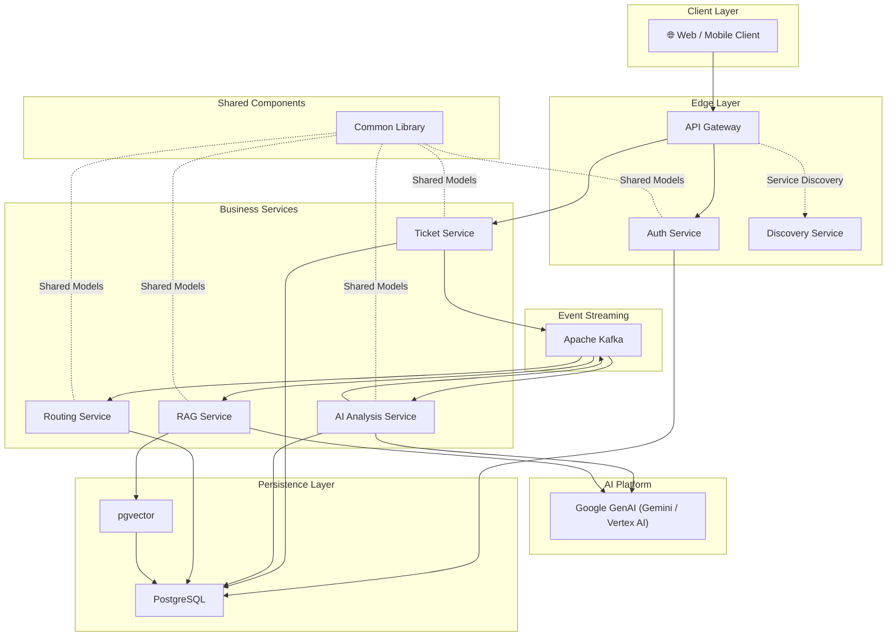

# Architectural Design & Decisions

## Architecture Diagram

## Architecture Decision Summary

| Decision | Selected Option | Alternatives Considered | Reason |
| ----------- | ---------------- | ------------------------- | -------- |
| Application Architecture | Microservices | Modular Monolith | Independent scaling and service isolation |
| Communication Pattern | Event-Driven | Synchronous REST-only | Reduced coupling and improved responsiveness |
| Message Broker | Apache Kafka | RabbitMQ, ActiveMQ | High throughput, durability, event replay capabilities |
| AI Provider | Google GenAI (Gemini/Vertex AI) | OpenAI, Self-hosted Models | Managed infrastructure and enterprise integration |
| Vector Storage | PostgreSQL + pgvector | Pinecone, Milvus, Weaviate | Reduced operational complexity and unified storage |
| Service Discovery | Eureka | Static Configuration | Dynamic service registration and scaling |
| API Entry Point | Spring Cloud Gateway | Direct Service Exposure | Centralized routing and security controls |
| Reliability Pattern | Outbox Pattern | Direct Event Publishing | Prevents message loss during failures |
| Resilience Strategy | Resilience4j | Custom Retry Logic | Standardized fault tolerance patterns |
| Tracing Strategy | Correlation IDs | Service-specific logging | End-to-end request observability |
| Consistency Strategy | Eventual Consistency | Distributed Transactions | Improved scalability and service autonomy |

## Detailed Explanation of Design Decisions

### 1. Microservices Architecture

We chose a microservices pattern over a monolithic design to decouple the AI processing, routing logic, core ticket management, and authentication (`auth-service`). This ensures that the heavy computational load or API rate limits of external AI models (in `ai-analysis-service` and `rag-service`) do not impact the core ability to authenticate or view tickets.

### 2. Event-Driven Asynchronous Communication

By introducing **Apache Kafka** as a message broker, we decoupled the execution flows.

* **Why:** When a ticket is created, the `ticket-service` responds to the user immediately. AI analysis and routing happen in the background through Kafka events (`TicketCreatedEvent`, `AnalysisCompletedEvent`).
* **Benefit:** This dramatically improves API response times and prevents upstream timeouts if the AI service takes several seconds to process a prompt.

### 3. Service Registry and API Gateway

* **Eureka (`discovery-service`)**: Instead of hardcoding IP addresses or DNS names for inter-service communication, services register with Eureka. This enables dynamic scaling where instances can come and go without manual reconfiguration.
* **Spring Cloud Gateway (`api-gateway`)**: Provides a unified facade for external clients, obscuring the internal microservice topology. It uses the proactive **WebFlux (Reactive)** framework to handle massive concurrent throughput. It also handles CORS, routing, request lifecycle logging, and assigns a global `X-Correlation-Id` to all incoming requests.

### Authentication and trust boundaries

`auth-service` owns user credentials, roles, account state, login auditing, and refresh tokens. Passwords are stored only as adaptive hashes. JWT access tokens are short-lived and stateless; refresh tokens are persisted as hashes, rotated atomically on use, and revoked when an account is locked or its authorization changes.

The API Gateway is the external authentication enforcement point. It validates JWTs and replaces client-supplied identity headers such as `X-User-Id` and `X-User-Role` with verified values. Backend services trust those headers and must therefore remain network-private. Direct public exposure of a backend service invalidates this trust model.

### 4. Distributed Tracing and Observability

To ensure deep observability across asynchronous and synchronous boundaries:

* A `CorrelationIdFilter` intercepts all HTTP requests across every service, binding the `X-Correlation-Id` to the `MDC` for Logback output (e.g., `%X{correlationId}`).
* When publishing Kafka events, the MDC correlation ID is embedded directly into the Kafka message headers and seamlessly extracted by consumers, guaranteeing traceability from gateway entry to eventual processing.

### 5. Resilient Event Publishing (Outbox Pattern)

To handle discrepancies and ensure zero-loss observability across Kafka interactions, an **Outbox Pattern** is implemented across publishing services (e.g. `ticket-service`, `ai-analysis-service`). Background asynchronous schedulers publish pending events, and maintain strict tracking with a `retryCount` mechanism (up to `MAX_RETRIES`), eventually escalating unrecoverable tasks to a `DEAD` status flag.

### 6. Shared Library (`common-library`)

To avoid code duplication (especially around DTOs and Kafka Event schemas), a shared library was created. While microservices best practices generally advocate for entirely disjointed codebases ("share nothing"), sharing contracts/events (`TicketCreatedEvent`, `TicketStatus`, `KafkaTopics`, etc.) in a strongly typed language (Java) prevents serialization errors and severe mismatch issues during payload parsing.

## Technology Stack and Rationale

| Technology | Usage | Rationale |
| :--- | :--- | :--- |
| **Java 21** | Core Language | Utilizes modern Java features like virtual threads (Project Loom) suitable for high API throughput. |
| **Spring Boot 4.x** | App Framework | Rapid development, vast ecosystem, and native support for Spring Cloud patterns. |
| **Spring Cloud** | Microservices Tooling | Native integrations for Gateway and Eureka Service Discovery. |
| **Spring AI** | AI Orchestration | Provides a unified, provider-agnostic abstraction layer. Current active provider is Google GenAI, with OpenAI retained as an optional/fallback-ready integration. |
| **PostgreSQL** | Primary Database | Robust, ACID-compliant relational storage. Reliable for ticket states and metadata. |
| **pgvector** | Vector Store | Extension for PostgreSQL allowing efficient similarity search for the `rag-service` embeddings without needing a standalone vector DB (like Milvus or Pinecone). |
| **Apache Kafka** | Event Broker | Highly durable and scalable log-based messaging perfect for choreography-based sagas and asynchronous processing. |
| **Resilience4j** | Circuit Breaker | Prevents cascading failures when a downstream service (or an external API like Google GenAI) becomes unresponsive or throws rate limit errors. |

## Scalability and Performance Considerations

### Scaling Out (Horizontal)

The architecture is inherently stateless at the application layer. By leveraging the Eureka discovery service, you can dynamically spin up multiple instances of any bottlenecked service.

* *Example:* If ticket volume spikes, you can deploy more `ai-analysis-service` instances consuming from the same Kafka consumer group to process the backlog in parallel.

### Database Performance

* **Read/Write Split:** Currently utilizing a single PostgreSQL instance. As read capacity becomes a bottleneck, the architecture can be adapted to use read replicas.
* **Vector Search:** `pgvector` queries scale reasonably well, but for massive datasets (millions of documents), specific indexes (like IVFFlat or HNSW) must be applied to the embedding vectors, or the vector store could be partitioned.

### Resilience and Circuit Breaking

* **External API Limits:** The active Google GenAI integration (with optional OpenAI support) can face rate-limiting (`429 Too Many Requests`). `Resilience4j` is configured to wrap these calls, failing fast when the circuit opens, returning a fallback response, and preventing threads from hanging in the `ai-analysis-service`.

### Asynchronous Throughput

* **Virtual Threads:** Spring Boot 3.2+ (and 4.x) running on Java 21 heavily uses virtual threads. This optimizes the API Gateway and WebMVC controllers by efficiently handling thousands of concurrent I/O-bound requests (e.g., waiting for a DB query or an external API) without exhausting the operating system thread pool.
