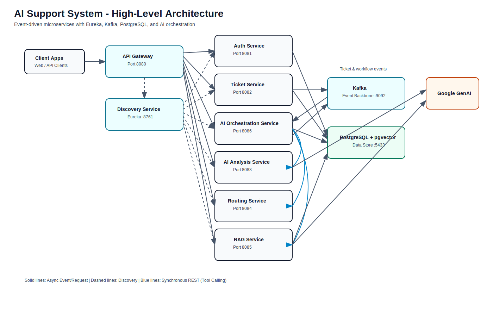
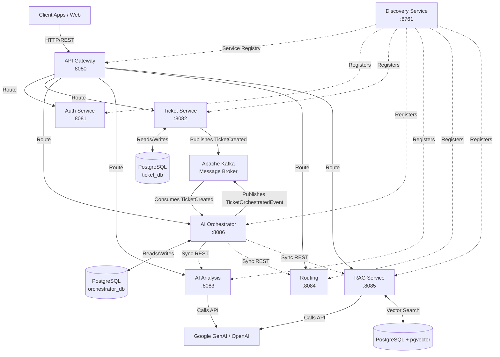
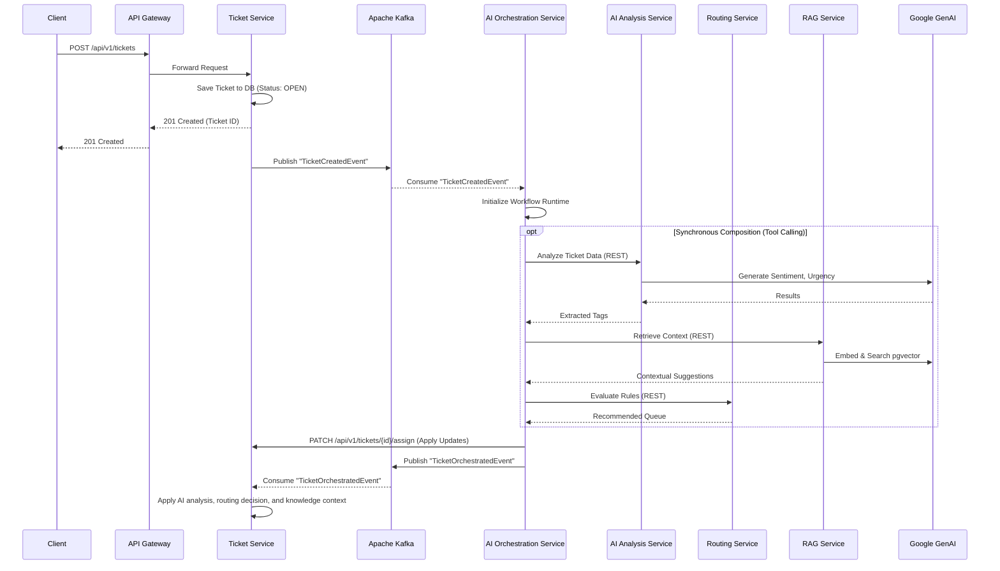

# System Overview

## High-Level System Architecture

The AI Support System is built using a microservices architecture pattern. This approach allows independent scaling, development, and deployment of distinct business capabilities. Each microservice is designed to be loosely coupled, communicating primarily through RESTful APIs and asynchronous messaging via Apache Kafka. The system is structured around a central API Gateway that serves as the single entry point for all client interactions, ensuring consistent request handling and traceability across services.

### Core Components

1. **Client / API Gateway (`api-gateway`)**: Built iteratively on Spring Cloud Gateway WebFlux, serving as the single entry point. It handles request tracing by generating a unique `X-Correlation-Id` for every incoming request and routing them to the appropriate backend microservice.
2. **Service Registry (`discovery-service`)**: Utilizes Netflix Eureka to allow microservices to register themselves and discover each other dynamically.
3. **Authentication (`auth-service`)**: Manages user authentication, authorization, and issues JWTs for secure access across the microservices.
4. **Ticket Management (`ticket-service`)**: Handles the core CRUD operations for support tickets, applying state machine validations for status transitions, and persists data to PostgreSQL.
5. **AI Workflow Runtime (`ai-orchestration-service`)**: The central orchestrator that consumes events and coordinates the AI execution lifecycle.
6. **AI Processing (`ai-analysis-service`)**: Domain capability providing sentiment analysis, urgency detection, and intent extraction via Google GenAI.
7. **Intelligent Routing (`routing-service`)**: Domain capability providing deterministic ticket routing decisions based on AI tags.
8. **Knowledge Context (`rag-service`)**: Domain capability providing intelligent, context-aware responses via `pgvector`.
9. **AI Support Marketplace (`ai-support-marketplace`)**: A plugin and tooling ecosystem that extends development capabilities with agents, hooks, and commands.

## Module Interactions and Dependencies

The system employs both synchronous and asynchronous communication:

* **Synchronous (REST)**: Handled primarily through the API Gateway for external requests, or directly via Eureka service discovery for direct service-to-service queries (e.g., fetching ticket details). All synchronized requests are logged with a traceable `X-Correlation-Id`.
* **Asynchronous (Event-Driven)**: Handled via Apache Kafka. When a significant domain event occurs (such as a ticket being created), an event is reliably published to a Kafka topic leveraging a robust **Outbox Pattern** with retry semantics. The `ai-orchestration-service` reacts to these business events and manages the asynchronous workflow execution, extracting the correlation ID directly from Kafka headers for consistent lifecycle tracing.

## Diagrams

### 1. High-Level Architecture Flowchart

### 2. Sequence Diagram: Ticket Creation & AI Routing

