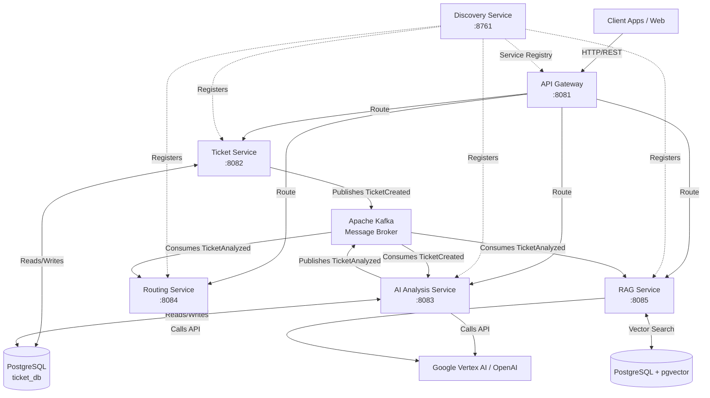
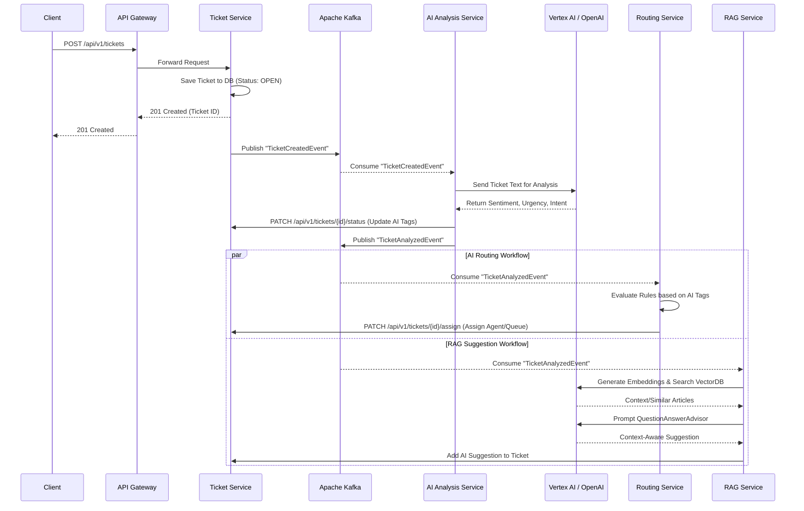

# System Overview

## High-Level System Architecture

The AI Support System is built using a microservices architecture pattern. This approach allows independent scaling, development, and deployment of distinct business capabilities. 

### Core Components

1. **Client / API Gateway (`api-gateway`)**: Serves as the single entry point for all incoming requests, routing them to the appropriate backend microservice.
2. **Service Registry (`discovery-service`)**: Utilizes Netflix Eureka to allow microservices to register themselves and discover each other dynamically.
3. **Ticket Management (`ticket-service`)**: Handles the core CRUD operations for support tickets and persists data to PostgreSQL.
4. **AI Processing (`ai-analysis-service`)**: Integrates with Google Vertex AI or OpenAI to perform sentiment analysis, determine urgency, and extract user intent from ticket content.
5. **Intelligent Routing (`routing-service`)**: Applies business rules to the AI-generated tags to route tickets to specific agents or queues.
6. **Knowledge Context (`rag-service`)**: A Retrieval-Augmented Generation service that queries a vector database (`pgvector`) to provide intelligent, context-aware responses and suggestions.

## Module Interactions and Dependencies

The system employs both synchronous and asynchronous communication:

*   **Synchronous (REST)**: Handled primarily through the API Gateway for external requests, or directly via Eureka service discovery for direct service-to-service queries (e.g., fetching ticket details).
*   **Asynchronous (Event-Driven)**: Handled via Apache Kafka. When a significant domain event occurs (such as a ticket being created), an event is published to a Kafka topic. Services like `ai-analysis-service` and `routing-service` react to these events without tight coupling.

## Diagrams

### 1. High-Level Architecture Flowchart

### 2. Sequence Diagram: Ticket Creation & AI Routing

