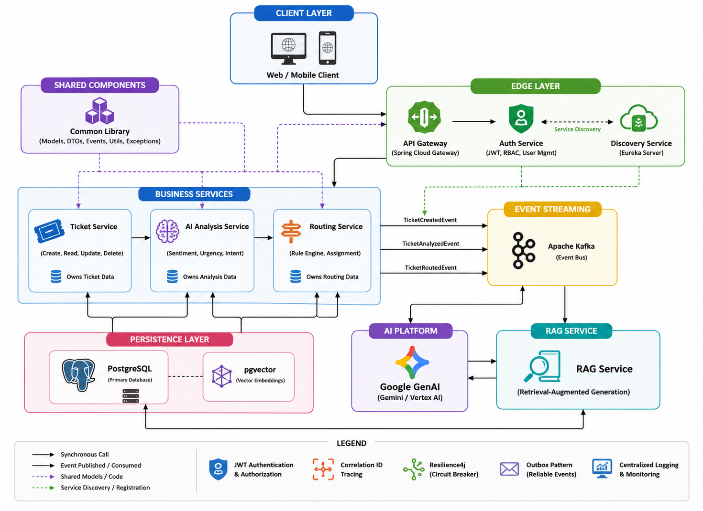
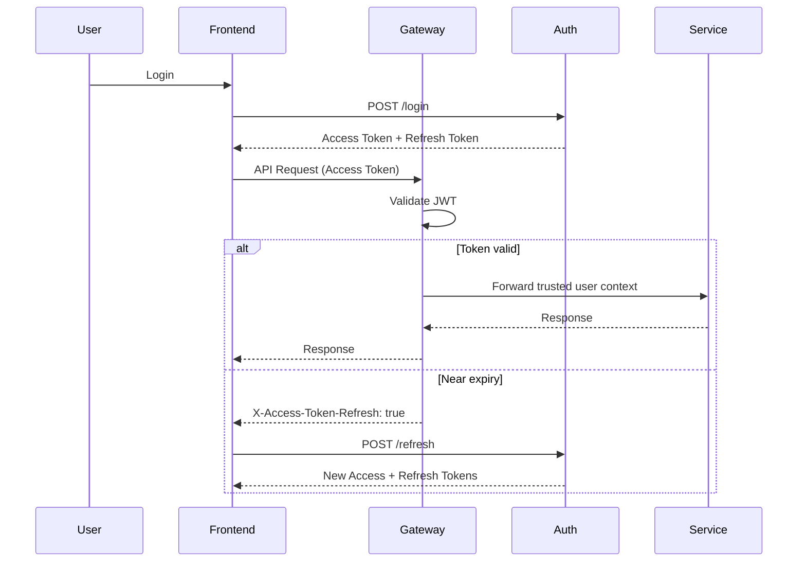
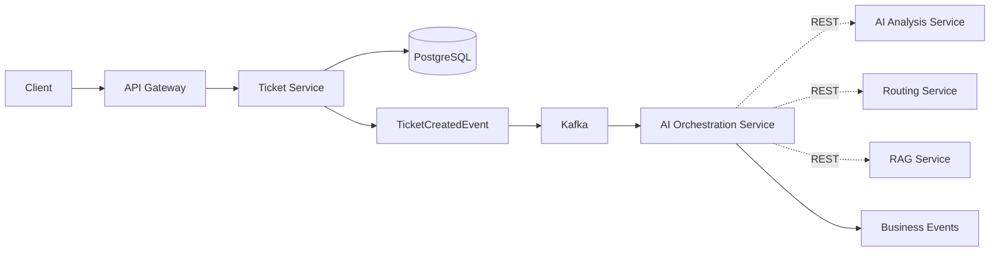

# AI Support System Microservices Platform

<!-- Project Status & Quality -->
[](https://github.com/avisheksingha/ai-support-system/releases/latest)
[](https://github.com/avisheksingha/ai-support-system/stargazers)
[](https://github.com/avisheksingha/ai-support-system/actions/workflows/ci-cd.yml)
[](https://github.com/avisheksingha/ai-support-system/actions/workflows/github-code-scanning/codeql)
[](https://github.com/avisheksingha/ai-support-system/actions/workflows/dependabot/dependabot-updates)
[](https://github.com/avisheksingha/ai-support-system/actions/workflows/deploy-aws.yml)

<!-- Tech Stack -->
[](https://openjdk.org/projects/jdk/21/)
[](https://spring.io/projects/spring-boot)
[](https://spring.io/projects/spring-cloud)
[](https://kafka.apache.org/)
[](https://www.postgresql.org/)
[](https://www.docker.com/)

<!-- Docs & Tools -->
[](OVERVIEW.md)
[](.github/copilot-instructions.md)

## Table of Contents

| Section | Purpose |
| --------- | ------------- |
| [Business Problem](#business-problem) | The customer support challenges this platform is designed to solve. |
| [Solution](#solution) | How the platform leverages AI and microservices to address those challenges. |
| [Why This Project](#why-this-project) | Highlights the enterprise engineering practices demonstrated in this repository. |
| [Feature Matrix](#feature-matrix) | Overview of the platform's implemented capabilities. |
| [Overview](#overview) | High-level introduction and links to detailed architecture documentation. |
| [Architecture](#architecture) | System architecture, technology stack, and microservice responsibilities. |
| [Engineering Decisions](#engineering-decisions) | Design choices, trade-offs, and technology selection rationale. |
| [Local Development](#local-development) | Prerequisites, runtime profiles, and local setup instructions. |
| [API Documentation](#api-documentation) | Available service endpoints, Swagger locations, and local access URLs. |
| [Authentication Architecture](#authentication-architecture) | JWT authentication model, security flow, and authorization strategy. |
| [Sample API Flow](#sample-api-flow) | End-to-end example demonstrating request processing through the platform. |
| [Project Structure](#project-structure) | Repository organization and purpose of each major module. |
| [Contributing](#contributing) | Contribution workflow, coding standards, and pull request process. |
| [Security](#security) | Security policy and responsible vulnerability disclosure process. |
| [Community Health](#community-health) | Community guidelines, issue templates, and project governance. |
| [License](#license) | Project licensing information. |

## Business Problem

Modern customer support teams often handle hundreds or thousands of tickets across multiple channels. As ticket volumes grow, manual triage becomes increasingly difficult and introduces several operational challenges:  

- Urgent customer issues may not be identified quickly enough.
- Tickets can be assigned to the wrong team or support queue.
- Support agents spend valuable time performing repetitive classification tasks.
- Knowledge retrieval becomes slower as historical ticket data grows.
- Inconsistent prioritization can negatively impact customer satisfaction and response times.

Organizations need a scalable solution that can automatically analyze incoming requests, identify urgency, route tickets intelligently, and provide contextual assistance to support teams.

## Solution

The AI Support System is a microservices-based platform designed to automate support ticket processing using Artificial Intelligence and event-driven architecture.

The platform combines AI-powered sentiment analysis, urgency detection, intelligent routing, and Retrieval-Augmented Generation (RAG) to streamline support operations and reduce manual intervention.

Key capabilities include:

- AI-driven sentiment and urgency analysis using Google GenAI (Gemini/Vertex AI).
- Event-driven asynchronous processing using Apache Kafka.
- Intelligent ticket routing based on business rules and AI insights.
- Semantic search and contextual knowledge retrieval using PostgreSQL pgvector.
- Distributed microservices architecture built with Spring Boot and Spring Cloud.
- Correlation ID–based request tracing across services.
- Scalable and cloud-ready deployment architecture.

The result is a system that demonstrates how modern AI services, vector search, and event-driven microservices can work together to improve customer support workflows while maintaining scalability, observability, and maintainability.

## Why This Project?

This project demonstrates enterprise backend engineering practices, including:

- Event-driven microservices
- AI-assisted ticket analysis
- Retrieval-Augmented Generation (RAG)
- JWT authentication with token rotation
- Distributed tracing using Correlation IDs
- Outbox Pattern for reliable messaging
- Circuit breakers with Resilience4j
- Cloud-ready deployment using Docker and Kubernetes

## Feature Matrix

| Capability            | Description                                      |
| --------------------- | ------------------------------------------------ |
| Ticket Management     | REST-based CRUD with lifecycle management        |
| AI Sentiment Analysis | Google GenAI-powered sentiment classification    |
| Intelligent Routing   | Rule-based routing using AI insights             |
| RAG                   | Context-aware knowledge retrieval using pgvector |
| Event Processing      | Kafka-based asynchronous workflows               |
| Observability         | Correlation ID tracing across services           |
| Reliability           | Outbox Pattern and Resilience4j                  |
| Deployment            | Docker Compose infrastructure                    |
| CI/CD                 | Automated GitHub Actions pipeline                |

## Overview

The AI Support System is a leading-edge, microservices-based ticket management platform designed to automate and augment traditional support workflows. It leverages AI for analyzing ticket sentiment, urgency, and intent, employs event-driven communication via Apache Kafka, and utilizes rule-based orchestration to intelligently route tickets. Finally, it integrates a Retrieval-Augmented Generation (RAG) service to provide contextual AI responses.

> For a comprehensive mapping of the system flow, module interactions, and diagrams, please refer to the **[System Overview](OVERVIEW.md)** document.
> For a detailed explanation of design decisions, technology stack rationale, and scalability considerations, see the **[Architecture](ARCHITECTURE.md)** document.
> For test execution commands (including controller/service test pack), see **[Testing Guide](TESTING.md)**.

## Architecture

### Architecture Diagram



### Technology Stack

| Category          | Technology                             |
| ----------------- | -------------------------------------- |
| Language          | **Java 21**                            |
| Framework         | **Spring Boot** 4.1.0                  |
| Cloud             | **Spring Cloud** 2025.1.2              |
| AI                | **Spring AI** 2.0.0 + **Google GenAI** |
| Messaging         | **Apache Kafka**                       |
| Database          | **PostgreSQL** + **pgvector**          |
| Security          | **JWT** + **Spring Security**          |
| Build             | **Maven**                              |
| Containers        | **Docker Compose**                     |
| CI/CD             | **GitHub Actions**                     |
| API Documentation | **SpringDoc OpenAPI**                  |

### Architecture & Key Components

- **[discovery-service](discovery-service/README.md)**: Eureka Service Discovery Server.
- **[api-gateway](api-gateway/README.md)**: Centralized entry point and request routing.
- **[auth-service](auth-service/README.md)**: Authentication, authorization, and JWT management.
- **[ticket-service](ticket-service/README.md)**: Core ticket management and lifecycle operations.
- **[ai-orchestration-service](ai-orchestration-service/README.md)**: Central workflow runtime that coordinates AI executions by composing domain capabilities.
- **[ai-analysis-service](ai-analysis-service/README.md)**: Domain capability service for AI-powered analysis (sentiment and urgency).
- **[routing-service](routing-service/README.md)**: Domain capability service for deterministic ticket routing decisions.
- **[rag-service](rag-service/README.md)**: Domain capability service providing vector embedding and contextual knowledge retrieval.
- **[common-library](common-library/README.md)**: Shared models, DTOs, events, and utilities.
- **[ai-support-marketplace](ai-support-marketplace/README.md)**: AI assistant plugins, agents, and tooling ecosystem.
- **[aisupport-parent](aisupport-parent/README.md)**: Central Maven POM for uniform dependency management.
- **[infra](infra/README.md)**: Docker Compose setup for infrastructure (PostgreSQL, Kafka, pgvector, Redpanda Console).

## Engineering Decisions

### Why Microservices?

The platform is intentionally designed as a microservices architecture to demonstrate service isolation, independent scalability, and clear separation of responsibilities across ticket management, AI analysis, routing, and knowledge retrieval domains.

### Why Apache Kafka?

Ticket processing involves multiple asynchronous operations such as AI analysis, routing decisions, and knowledge enrichment. Apache Kafka enables event-driven communication between services while reducing direct service-to-service coupling and improving scalability.

### Why PostgreSQL with pgvector?

Traditional relational data is stored in PostgreSQL while pgvector enables semantic similarity search for Retrieval-Augmented Generation (RAG) workflows. This combination allows structured transactional storage and AI-powered contextual retrieval within the same database platform.

### Why Google GenAI (Gemini / Vertex AI)?

Google GenAI (via Vertex AI or Gemini API) provides managed access to modern foundation models for sentiment analysis, urgency detection, and intent classification while reducing operational overhead associated with hosting and maintaining custom AI models.

### Why Spring Boot and Spring Cloud?

Spring Boot accelerates microservice development through convention-based configuration, while Spring Cloud provides service discovery, gateway routing, and cloud-native integration patterns commonly used in enterprise environments.

### Why Event-Driven Processing?

Support tickets do not require synchronous AI processing before being created. Event-driven processing allows tickets to be accepted immediately while downstream services perform analysis and routing asynchronously, improving responsiveness and user experience.

## Local Development

### Prerequisites

- Java 21+
- Maven 3.9+ (or use included wrapper)
- Docker & Docker Compose (for spinning up Kafka, ZooKeeper, PostgreSQL, etc.)

### Runtime Profiles

Each service supports profile-driven startup:

`spring.profiles.active=${SPRING_PROFILES_ACTIVE:local}`

- `local`: IDE/local development
- `docker`: Docker network runtime
- `k8s`: Kubernetes runtime using explicit service URLs

Discovery strategy:

- `local`/`docker`: Eureka-based service discovery
- `k8s`: Eureka clients disabled, environment-based service URLs

### AI-Assisted Development

This repository uses AI coding assistants (including GitHub Copilot) as productivity tools for scaffolding, refactoring suggestions, and test drafting.

Engineering policy:

- AI-generated code is reviewed and validated before merge.
- Build/test checks must pass before PR approval.
- Security-sensitive decisions (credentials, logging, deployment config) are manually reviewed by the maintainer.

### 1. Configure Environment Variables

Create a `.env` file in the project root by copying `.env.example` and updating the required values.

```bash
cp .env.example .env
```

> **Note:** Windows users can manually copy `.env.example` to `.env`.

---

### 2. Start Infrastructure

Start the local infrastructure required by the microservices.

This launches:

- PostgreSQL + PGVector
- Apache Kafka
- Apache ZooKeeper
- Redpanda Console (Kafka UI at <http://localhost:9090>)

```bash
docker compose --env-file .env -f infra/docker-compose.yml up -d
```

Verify the containers are running:

```bash
docker ps
```

---

### 3. Stop Infrastructure

Stop all infrastructure containers while preserving database data.

```bash
docker compose -f infra/docker-compose.yml down
```

---

### 4. Reset Local Database (Optional)

Stop the infrastructure and remove all Docker volumes.

> **Warning**
> This permanently deletes all local PostgreSQL data and recreates the database on the next startup.

```bash
docker compose -f infra/docker-compose.yml down -v
```

---

### 5. Start the Microservices

Once the infrastructure is running, start the Spring Boot microservices from your IDE (recommended for local development) or using Maven.

Recommended startup order:

1. discovery-service
2. api-gateway
3. auth-service
4. ticket-service
5. ai-analysis-service
6. routing-service
7. rag-service

## API Documentation

Each service provides its own OpenAPI documentation. Available locally at:

| Service     | Port | Swagger                  |
| ----------- | ---: | ------------------------ |
| Auth        | 8081 | `/swagger-ui/index.html` |
| Ticket      | 8082 | `/swagger-ui/index.html` |
| AI Analysis | 8083 | `/swagger-ui/index.html` |
| Routing     | 8084 | `/swagger-ui/index.html` |
| RAG         | 8085 | `/swagger-ui/index.html` |
| Gateway     | 8080 | `/` (entrypoint)         |
| Eureka      | 8761 | `/` (dashboard)          |
| Redpanda    | 9090 | `/overview` (Kafka UI)   |

## Authentication Architecture

> The AI Support System uses a stateless JWT authentication model with rotating refresh tokens. Authentication is centralized in the API Gateway, ensuring that backend microservices never receive unverified requests. The gateway validates every access token, strips client-supplied identity headers, and forwards trusted user information to downstream services.

### Security Model

| Component        | Responsibility                                                                    |
| ---------------- | --------------------------------------------------------------------------------- |
| Frontend         | Stores tokens securely and refreshes access tokens when required                  |
| API Gateway      | Validates JWTs, removes spoofed identity headers, propagates trusted user context |
| Auth Service     | Handles registration, login, logout, token refresh, and user management           |
| Backend Services | Trust the gateway and focus exclusively on business logic                         |

### Token Lifecycle

| Token         |   Lifetime | Purpose                                                        |
| ------------- | ---------: | -------------------------------------------------------------- |
| Access Token  | 15 minutes | Authenticate API requests                                      |
| Refresh Token |     7 days | Obtain new access and refresh tokens without re-authentication |

### Protected Endpoints

| Endpoint        | Authentication         | Authorization      |
| --------------- | ---------------------- | ------------------ |
| Register        | Public                 | —                  |
| Login           | Public                 | —                  |
| Refresh         | Public (Refresh Token) | —                  |
| Logout          | Required               | Authenticated User |
| `/me`           | Required               | Authenticated User |
| User Management | Required               | `ADMIN`            |

### Authentication Flow



### Authentication Principles

- Backend services are never exposed directly to external clients.
- All client traffic enters through the API Gateway.
- Identity is established only after JWT validation.
- Client-supplied identity headers are discarded to prevent spoofing.
- Refresh tokens are rotated on every successful refresh.
- Business services remain stateless and do not perform authentication.

## Sample API Flow

Run this end-to-end flow to demonstrate the project quickly:

**1. Create a ticket through the gateway.**

```bash
curl -X POST "http://localhost:8080/api/v1/tickets" \
  -H "Content-Type: application/json" \
  -d "{\"title\":\"Payment failed\",\"description\":\"Card charged twice and order missing\",\"customerEmail\":\"demo@example.com\"}"
```

**2. Get all tickets (or inspect the created ID).**

```bash
curl "http://localhost:8080/api/v1/tickets"
```

**3. Check ticket details by ID.**

```bash
curl "http://localhost:8080/api/v1/tickets/{ticketId}"
```

### What Happens Next?

1. Client submits a ticket through the API Gateway.
2. The `ticket-service` persists the ticket and immediately returns a response.
3. A `TicketCreatedEvent` is published to Apache Kafka.
4. The `ai-orchestration-service` consumes the event and starts a workflow.
5. The orchestrator composes the `ai-analysis-service` (via synchronous REST tools) for sentiment/urgency, and the `rag-service` for knowledge retrieval.
6. Based on the analysis, it coordinates with the `routing-service` to assign the ticket to the appropriate queue.
7. A `TicketOrchestratedEvent` is published asynchronously upon workflow completion, carrying the final analysis, routing decision, and knowledge context back to the `ticket-service`.
s.
8. Correlation IDs enable end-to-end request tracing across all services.

### Processing Flow



> **Hybrid Communication Model:** The platform intentionally uses Kafka for asynchronous business events (like `TicketCreatedEvent`), while the AI Orchestration Service uses synchronous REST/internal clients to execute Tool Calling and compose the domain capabilities.

## Project Structure

```plaintext
ai-support-system/
├── .github/                # GitHub Actions, issue templates, and Copilot guidance
├── discovery-service/      # Eureka Server (Port: 8761)
├── api-gateway/            # Spring Cloud Gateway (Port: 8080)
├── auth-service/           # Authentication & Authorization (Port: 8081)
├── ticket-service/         # Ticket Management (Port: 8082)
├── ai-analysis-service/    # AI Analysis via Google GenAI (OpenAI optional) (Port: 8083)
├── routing-service/        # Intelligent Routing Orchestrator (Port: 8084)
├── rag-service/            # Contextual Knowledge Response (Port: 8085)
├── common-library/         # Shared DTOs and Logic
├── aisupport-parent/       # Maven Parent POM
├── infra/                  # Docker Config for DB/Kafka/Redpanda Console
├── docs/                   # Architecture diagram and visuals
├── ARCHITECTURE.md         # Design decisions and scalability
├── CONTRIBUTING.md         # Contribution workflow and PR expectations
├── OVERVIEW.md             # Architectural end-to-end details & diagrams
├── SECURITY.md             # Vulnerability reporting policy
├── TESTING.md              # Test execution and troubleshooting guide
└── README.md               # This file
```

### Internal Package Structure

The microservices follow a **Dual Package Philosophy**:

1. **Standard Domain Services** (e.g., `ticket-service`, `auth-service`, `rag-service`): Strictly adhere to a flat structure (`config`, `controller`, `service`, `repository`, `dto/request`, `dto/response`) avoiding abstract layers to maximize Spring Boot discoverability.
2. **Orchestrator** (`ai-orchestration-service`): Uses a strict feature-first Hexagonal Architecture (`config`, `application`, `domain`, `infrastructure`) due to its role in coordinating complex multi-agent AI workflows.

> **Note:** The backend package structure is structurally frozen for V1. Please see [12. Package and Naming Convention](docs/architecture/12-package-and-naming-convention.md) for detailed guidelines.

## Contributing

Please see [CONTRIBUTING.md](CONTRIBUTING.md) for contribution workflow, PR expectations, and contribution guidelines.

## Security

Please see [SECURITY.md](SECURITY.md) for vulnerability reporting and security response policy.

## Community Health

- Contribution guide: [CONTRIBUTING.md](CONTRIBUTING.md)
- Security policy: [SECURITY.md](SECURITY.md)
- Issue templates: `.github/ISSUE_TEMPLATE/`
- PR template: `.github/pull_request_template.md`

## License

MIT License
