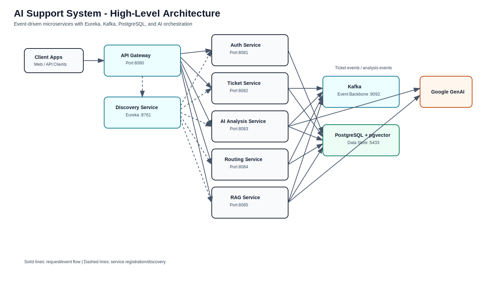

# AI Support System Microservices Platform

[](https://openjdk.org/projects/jdk/21/)
[](https://spring.io/projects/spring-boot)
[](https://spring.io/projects/spring-cloud)
[](https://kafka.apache.org/)
[](https://www.postgresql.org/)
[](https://www.docker.com/)
[](OVERVIEW.md)
[](.github/workflows/ci-cd.yml)
[](https://github.com/avisheksingha/ai-support-system/actions/workflows/ci-cd.yml)

## Overview

The AI Support System is a leading-edge, microservices-based ticket management platform designed to automate and augment traditional support workflows. It leverages AI for analyzing ticket sentiment, urgency, and intent, employs event-driven communication via Apache Kafka, and utilizes rule-based orchestration to intelligently route tickets. Finally, it integrates a Retrieval-Augmented Generation (RAG) service to provide contextual AI responses.

> For a comprehensive mapping of the system flow, module interactions, and diagrams, please refer to the **[System Overview](OVERVIEW.md)** document.
> For a detailed explanation of design decisions, technology stack rationale, and scalability considerations, see the **[Architecture](ARCHITECTURE.md)** document.
> For test execution commands (including controller/service test pack), see **[Testing Guide](TESTING.md)**.

## Architecture Diagram



## Architecture & Key Components

- **[discovery-service](discovery-service/README.md)**: Eureka Service Discovery Server.
- **[api-gateway](api-gateway/README.md)**: Centralized entry point and request routing.
- **[ticket-service](ticket-service/README.md)**: Core ticket management and lifecycle operations.
- **[ai-analysis-service](ai-analysis-service/README.md)**: AI-powered analysis for sentiment and urgency (Gemini & OpenAI).
- **[routing-service](routing-service/README.md)**: Orchestrator for intelligent ticket assignment based on analysis.
- **[rag-service](rag-service/README.md)**: Vector embedding and RAG capabilities for automated contextual responses.
- **[common-library](common-library/README.md)**: Shared models, DTOs, events, and utilities.
- **[aisupport-parent](aisupport-parent/README.md)**: Central Maven POM for uniform dependency management.
- **[infra](infra/README.md)**: Docker Compose setup for infrastructure (PostgreSQL, Kafka, pgvector).

## Technology Stack

- **Java**: 21
- **Spring Boot**: 4.0.4
- **Spring Cloud**: 2025.1.0
- **Spring AI**: 2.0.0-M1
- **Messaging**: Apache Kafka
- **Database**: PostgreSQL (with `pgvector` extension)
- **Service Discovery**: Eureka
- **API Documentation**: SpringDoc OpenAPI

## Prerequisites

- Java 21+
- Maven 3.9+ (or use included wrapper)
- Docker & Docker Compose (for spinning up Kafka, PostgreSQL, etc.)

## Getting Started

### 0. Configure Environment Variables

Create a local `.env` file from the example and set your real values:

```bash
cp .env.example .env
```

PowerShell alternative:

```powershell
Copy-Item .env.example .env
```

### 1. Start Infrastructure

Start the underlying database and messaging infrastructure (infra-only compose):

```bash
docker compose -f infra/docker-compose.yml up -d
```

### 2. Build All Services

```bash
mvn -f aisupport-parent/pom.xml clean install
```

### 3. Run Services (In Order)

1. **Discovery Service**:

   ```bash
   cd discovery-service
   mvn spring-boot:run
   ```

2. **API Gateway**:

   ```bash
   cd api-gateway
   mvn spring-boot:run
   ```

3. **Core Services** (Start in parallel or sequentially):
   - Ticket Service: `cd ticket-service && mvn spring-boot:run`
   - AI Analysis Service: `cd ai-analysis-service && mvn spring-boot:run`
   - Routing Service: `cd routing-service && mvn spring-boot:run`
   - RAG Service: `cd rag-service && mvn spring-boot:run`

## Project Structure

```plaintext
ai-support-system/
├── discovery-service/    # Eureka Server (Port: 8761)
├── api-gateway/          # Spring Cloud Gateway (Port: 8080)
├── ticket-service/       # Ticket Management (Port: 8082)
├── ai-analysis-service/  # AI Analysis via Gemini/OpenAI (Port: 8083)
├── routing-service/      # Intelligent Routing Orchestrator (Port: 8084)
├── rag-service/          # Contextual Knowledge Response (Port: 8085)
├── common-library/       # Shared DTOs and Logic
├── aisupport-parent/     # Maven Parent POM
├── infra/                # Docker Config for DB/Kafka
├── ARCHITECTURE.md       # Design decisions and scalability
├── OVERVIEW.md           # Architectural end-to-end details & diagrams
└── README.md             # This file
```

## API Documentation

Each service provides its own OpenAPI documentation. Available locally at:

- Ticket Service: `http://localhost:8082/swagger-ui/index.html`
- AI Analysis Service: `http://localhost:8083/swagger-ui/index.html`
- Routing Service: `http://localhost:8084/swagger-ui/index.html`
- RAG Service: `http://localhost:8085/swagger-ui/index.html`
- Gateway (entrypoint): `http://localhost:8080`
- Eureka Dashboard: `http://localhost:8761`

## Sample API Flow

Run this end-to-end flow to demonstrate the project quickly:

1. Create a ticket through the gateway.

```bash
curl -X POST "http://localhost:8080/api/v1/tickets" \
  -H "Content-Type: application/json" \
  -d "{\"title\":\"Payment failed\",\"description\":\"Card charged twice and order missing\",\"customerEmail\":\"demo@example.com\"}"
```

1. Get all tickets (or inspect the created ID).

```bash
curl "http://localhost:8080/api/v1/tickets"
```

1. Check ticket details by ID.

```bash
curl "http://localhost:8080/api/v1/tickets/{ticketId}"
```

Expected behavior:

- Ticket is created immediately by `ticket-service`.
- AI analysis and routing happen asynchronously through Kafka.
- Logs show a shared `X-Correlation-Id` across gateway and services.

## Demo Video

- Recommended length: 3-5 minutes.
- Suggested flow:
  1. 30s architecture overview (diagram + service roles)
  2. 60s infrastructure start and service boot
  3. 90s API flow demo (create ticket -> async processing in logs)
  4. 30s Swagger and Eureka quick walkthrough
  5. 30s close with key engineering highlights (outbox, retries, tracing)
- Add your video link here: `https://youtu.be/<your-demo-id>`

## License

MIT License
