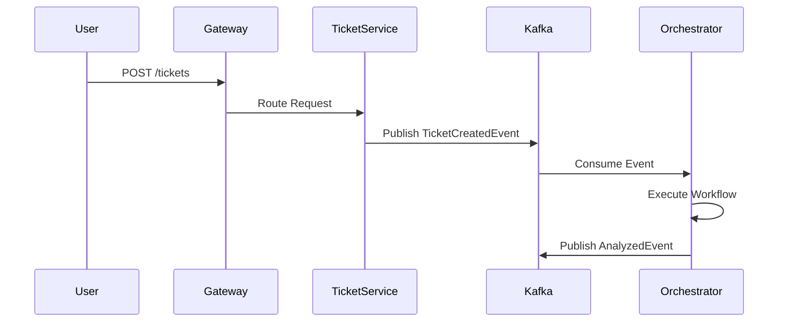

# System Overview

Version: 1.0
Status: Current
Last Updated: 2026-07-11
Related Documents:
- [02-runtime-architecture.md](02-runtime-architecture.md)
- [08-event-lifecycle.md](08-event-lifecycle.md)

**AI Support System** is a production-oriented AI workflow platform built on Spring Boot microservices. It combines event-driven architecture, workflow orchestration, context intelligence, AI reasoning, tool execution, governance, and observability into a modular backend platform for intelligent customer support.

## Why does the Orchestration Runtime exist?
Early in the project's life, AI capabilities were simply endpoints invoking an LLM. As the system matured, it became clear that enterprise AI requires a dedicated runtime to handle token budgeting, context retrieval, tool integration, and guardrail enforcement. The Orchestration Runtime exists to decouple these AI-specific concerns from business microservices like `ticket-service`.

## Services

- **`ai-orchestration-service`**: The AI runtime. It interprets workflows, enforces policies, gathers context, executes AI reasoning, and invokes tools.
- **`ticket-service`**: Manages the core domain lifecycle of tickets. Emits events when tickets are created or updated.
- **`auth-service`**: JWT authentication and role-based access control.
- **`api-gateway`**: Unified entry point for all external API calls.
- **`discovery-service`**: Eureka service registry.

## Request Lifecycle (Ticket Analysis)

