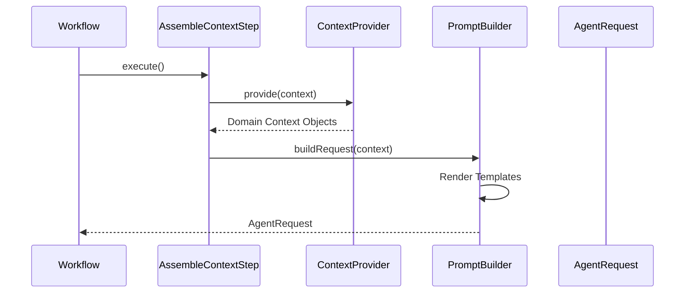

# Context Intelligence

Version: 1.0
Status: Current
Last Updated: 2026-07-11
Related ADRs:

- [ADR-002 Context Providers](../adr/ADR-002-context-providers.md)
- [ADR-004 Prompt Rendering](../adr/ADR-004-prompt-rendering.md)
Related Documents:
- [05-agent-execution.md](05-agent-execution.md)

One of the most complex parts of any AI system is context assembly. This architecture fully decouples data retrieval from prompt engineering.

## Context Assembly Flow

### 1. Context Providers

Implementations of `ContextProvider` (e.g., `ConversationContextProvider`, `KnowledgeContextProvider`) are automatically discovered and executed in priority order. They attach typed objects (like `ConversationContext`) directly into the `WorkflowContext`.

### 2. Prompt Builder & Renderer

The `PromptBuilder` delegates to a `PromptRenderer` which merges the assembled `WorkflowContext` into external templates (e.g., `analyze.st`). This ensures that logic stays in Java, and text templates stay in `.st` markdown files.
