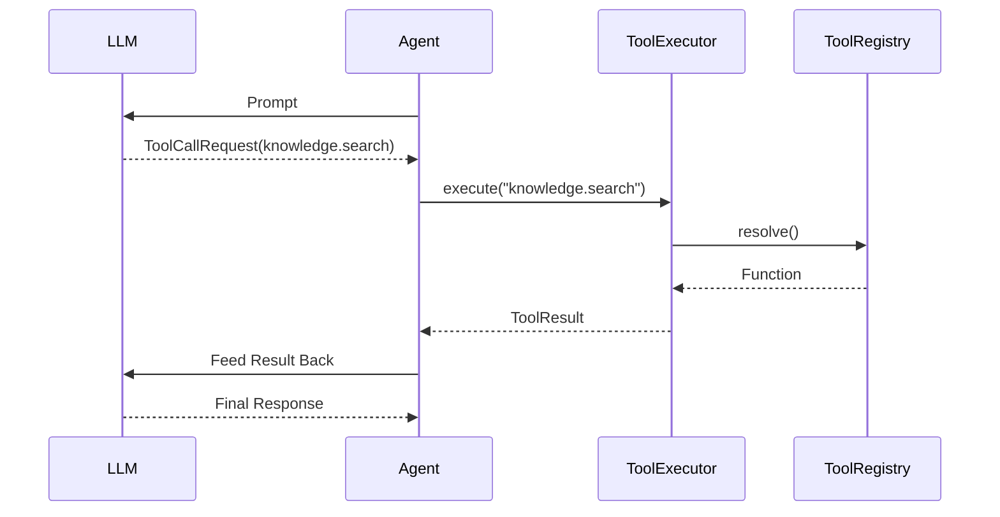
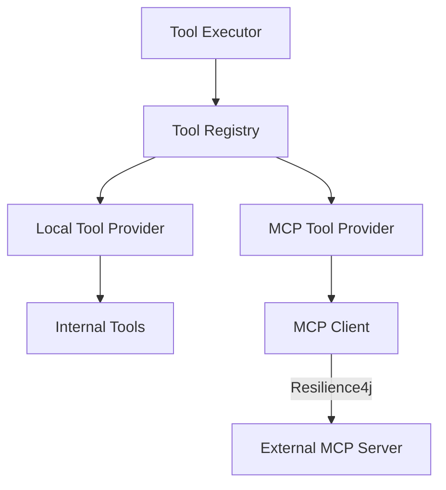

# Tool Execution

Version: 1.0
Status: Current
Last Updated: 2026-07-11
Related ADRs:

- [ADR-003 Tool Registry](../adr/ADR-003-tool-registry.md)
Related Documents:
- [07-governance-and-audit.md](07-governance-and-audit.md)

The **Tool Execution Loop** natively connects LLM reasoning with real business logic without forcing the Agent to know about microservice endpoints.

## Execution Loop

The `SpringAiAgent` acts as a multi-turn router:

## Adding a Tool

Tools are decoupled capabilities registered into the `ToolRegistry`. The Workflow simply passes a list of `allowedCapabilities` to the Agent Request, giving the workflow direct control over what the LLM is permitted to execute.

## Tool Providers & MCP Integration (Phase 5)

The `ToolRegistry` does not execute tools directly. It aggregates tools from multiple `ToolProvider`s:

- **`LocalToolProvider`**: Wraps internal Java capabilities (e.g. `KnowledgeSearchTool`).
- **`McpToolProvider`**: Dynamically discovers and wraps external enterprise capabilities via the Model Context Protocol (MCP).

### Provider Implementations

- **`github-mcp`**: External enterprise integration providing repository intelligence (search, issues, PRs).
- **`filesystem-mcp`**: Internal workspace provider constrained strictly by a configured `allowed-paths` list. Exists solely to provide the AI safe awareness of its own repository context (architecture docs, prompts, configuration) without allowing arbitrary file access.
- **`postgres-mcp`**: Read-only Operational Data Access provider. Exposes multiple named connections (`ticket-db`, `orchestration-db`) to provide live operational insights (ticket counts, workflow statuses) while explicitly denying any database modification via strict SQL validation layers.

### Resilience & Observability

External MCP calls are wrapped in **Resilience4j** to ensure transient network issues do not leak into the workflow:

- **Circuit Breaker**: Provider-specific breakers (e.g., `mcp-jira`).
- **Retry**: Only transient failures (e.g., HTTP 503, timeouts) are retried.
- **TimeLimiter**: Protects workflow execution from indefinitely blocking external AI calls.
- **Observability**: Metrics mapped via Micrometer (`mcp.discovery.latency`, `mcp.invocation.latency`) and exposed to Actuator Health endpoints.
