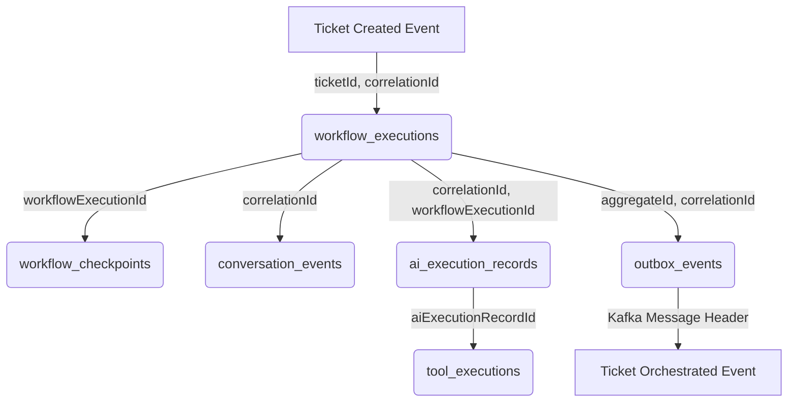

# Architecture Decision Record: Persistence Audit (V1 Stabilization)

**Status:** Approved | **Version:** 1.0.0
**Context:** Final stabilization and engineering validation for AI Orchestration Service.

## 1. Ownership Matrix

| Table                | Owner           | Mutable       | Purpose             |
| -------------------- | --------------- | ------------- | ------------------- |
| workflow_executions  | Workflow Engine | Yes           | Runtime state       |
| workflow_checkpoints | Workflow Engine | Append/Update | Recovery            |
| ai_execution_records | Audit Service   | Append Only   | Compliance          |
| outbox_events        | Outbox          | Lifecycle     | Integration         |
| tool_executions      | Future V2       | N/A           | Tool Calling        |
| conversation_events  | Future V2       | N/A           | Conversation Memory |

*Note: `conversation_events` and `tool_executions` are intentionally deferred for V2 and are expected to be empty in V1.*

## 2. Persistence Invariants

```text
WorkflowExecution
-----------------
Exactly one row per workflow execution.

WorkflowCheckpoint
------------------
One row per step execution.

AiExecutionRecord
-----------------
One row per agent invocation (Type: AGENT).
One row per workflow completion (Type: WORKFLOW).

OutboxEvent
-----------
Exactly one TicketOrchestratedEvent per completed workflow.

ConversationEvent
-----------------
Unused in V1.

ToolExecution
-------------
Unused in V1.
```

## 2. End-to-End Traceability

To ensure robust distributed tracing, the system propagates a single identity model across all events, workflow executions, internal tool calls, and downstream publishing.



### Traceability Chain Keys

```text
ticketId
   ↓
correlationId
   ↓
workflowExecutionId
   ↓
eventId
```

## 3. Physical SQL Validation

The following validation represents a true physical database verification from a full workflow execution triggered through a `POST /api/v1/tickets`.

**Trace Identities Extracted at Runtime:**

```text
Ticket ID               : 15
Correlation ID          : 6bb5a100-34fa-41c1-8840-7ac535fb1922
Workflow Execution ID   : e42a991b-7144-482f-bba3-2d251d182239
Event ID                : 2bc8201a-e660-4934-8fa7-889a744237db
```

### Consistency Validation Queries

**1. Workflow Executions**  

```sql
SELECT id, correlation_id, state, version 
FROM workflow_executions 
WHERE ticket_id = 15;
```

*Verification:* `correlation_id` exactly matches `6bb5a100...`, state is `COMPLETED`, version is `1`.

**2. Workflow Checkpoints**  

```sql
SELECT step_name, created_at 
FROM workflow_checkpoints 
WHERE workflow_execution_id = 'e42a991b-7144-482f-bba3-2d251d182239' 
ORDER BY created_at ASC;
```

*Verification:* Timestamps ascend sequentially across `Assemble Context`, `Analyze Ticket`, `Knowledge Search`, `Route Ticket`.

**3. AI Execution Records**  

```sql
SELECT id, record_type, outcome, workflow_duration_ms 
FROM ai_execution_records 
WHERE correlation_id = '6bb5a100-34fa-41c1-8840-7ac535fb1922';
```

*Verification:* Exactly two rows (one `AGENT` with tool metrics, one `WORKFLOW` with full duration).

**4. Outbox Events**  

```sql
SELECT id, event_type, status, correlation_id 
FROM outbox_events 
WHERE aggregate_id = '15';
```

*Verification:* `status` has transitioned from `PENDING` to `SENT`, `correlation_id` matches.

### Consistency Checklist (Per Table)

- [x] ticketId populated
- [x] correlationId populated
- [x] workflowExecutionId populated
- [x] timestamps populated
- [x] durations > 0
- [x] no orphan records
- [x] no duplicate workflow executions
- [x] no duplicate outbox events
- [x] no unexpected NULLs
- [x] record lifecycle valid
