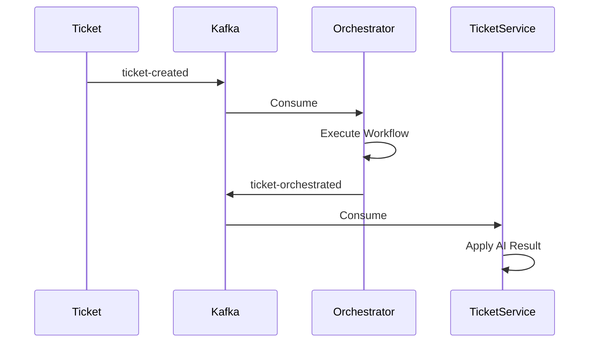

# Event Contract: `TicketOrchestratedEvent`

## Purpose

The `TicketOrchestratedEvent` is the central integration event of the AI Orchestration Platform. It signals that a ticket has completed its autonomous orchestration workflow. It carries all AI analysis, routing decisions, and retrieved knowledge context required by downstream systems.

## Event Semantics

The `TicketOrchestratedEvent` is emitted exactly once for a completed workflow execution.
The event represents the final orchestration outcome for a ticket.

It is emitted only after:

- Workflow execution completes
- All mandatory workflow steps finish
- Audit records are persisted
- The transactional outbox commits successfully

Consumers must treat this event as the authoritative AI processing result for the ticket. Consumers must never recompute AI analysis. Any future re-analysis requires a new orchestration workflow and a new event.

## Delivery Guarantees & Idempotency

Publishing is performed through the Transactional Outbox pattern.

Consumers should assume:

- At-least-once delivery
- Possible duplicate delivery
- Ordering guaranteed only per ticket

Consumers must treat duplicate events as expected behavior. Processing should be idempotent using:

- `eventId`
- `workflowExecutionId`

A duplicate event must never produce duplicate database updates.

## Topic Ownership

**Producer**:

- `ai-orchestration-service` (Single Producer - This prevents another service from accidentally publishing the same event.)

**Consumers**:

- `ticket-service`
- future `websocket-service`
- future `notification-service`
- future `analytics-service`

## Flow Diagram



## Event Lifecycle

The lifecycle of a ticket through the orchestration platform is:

```text
NEW
  ↓
ticket-created
  ↓
AI Orchestration Workflow
  ↓
ticket-orchestrated
  ↓
Ticket Updated
  ↓
Frontend Notification (future)
```

The `TicketOrchestratedEvent` is the final integration event for a workflow execution.

## Payload Structure

The event is designed as a structured JSON object containing nested sections.
*Implementation Note*: The event is represented internally using immutable Java Records. This guarantees thread safety, immutability, deterministic serialization, and compile-time typing.

### Schema

```json
{
  "ticketId": 12345,
  "ticketStatus": "ANALYZED",
  "analysis": {
    "intent": "Password Reset",
    "sentiment": "Frustrated",
    "urgency": "High"
  },
  "routing": {
    "assignToTeam": "L1-Support",
    "priority": "HIGH",
    "slaHours": 24
  },
  "knowledge": {
    "knowledgeSummary": "The user is attempting to reset their password. Suggest following KB-101.",
    "sources": [
      {
        "id": "KB-101",
        "title": "How to Reset Password",
        "similarityScore": 0.88
      }
    ],
    "confidence": 0.95
  },
  "aiDecision": {
    "aiSummary": "User is unable to access their account and needs a password reset link.",
    "suggestedReply": "Hello, please click the following link to securely reset your password: [Link]",
    "confidence": 0.92
  },
  "metadata": {
    "eventId": "123e4567-e89b-12d3-a456-426614174000",
    "eventVersion": 1,
    "correlationId": "corr-8888",
    "workflowExecutionId": "exec-9999",
    "workflowVersion": "1.0",
    "promptVersion": "1.0",
    "modelProfile": "gemini-2.5-flash",
    "orchestratorVersion": "1.0.0",
    "processingDurationMs": 1450,
    "outcome": "SUCCESS",
    "generatedAt": "2026-07-13T12:00:00Z"
  }
}
```

### ticketStatus

`ticketStatus` represents the resulting ticket workflow state after orchestration. It is not the internal runtime state of the Workflow Engine.

### Event Metadata

The metadata section exists exclusively for observability, auditing and debugging.
Business logic must never depend on:

- `promptVersion`
- `workflowVersion`
- `modelProfile`
- `orchestratorVersion`

Those values are informational and intended for tracing. `correlationId` and `workflowExecutionId` allow end-to-end tracing across:
`Ticket Service -> Kafka -> AI Orchestrator -> Audit -> Dashboard`

### Outcome Values

| Value | Meaning |
| -------- | ---------- |
| SUCCESS | Workflow completed successfully |
| PARTIAL_SUCCESS | Workflow completed but optional capabilities failed |
| FAILED | Workflow failed |
| REQUIRES_APPROVAL | Awaiting manual approval |

### Nullable Sections

Optional sections (like `knowledge`) may be `null` if that capability was skipped or failed. Consumers must tolerate missing optional sections.

## Non Goals

This event is not intended to:

- expose internal workflow execution details
- expose `AgentSession` internals
- expose `ToolRegistry` internals
- expose `WorkflowContext`

Those remain implementation details of the AI Orchestration Runtime.

## Evolution Rules (Frozen for V1)

1. **Immutability**: All fields represent a point-in-time snapshot of the orchestration execution.
2. **Extensibility**: New domains (e.g., `auditResult`) must be added as new nested objects. Existing objects should only be appended to.
3. **No Stringly-Typed Maps**: Do not introduce free-text JSON maps. All fields must map to strongly-typed records on the consumer side.
4. **Domain Ownership**: The `TicketOrchestratedEvent` represents the public integration contract. Internal runtime objects such as `WorkflowContext`, `WorkflowExecutionResult`, or `AgentSession` must never be exposed directly through this event.

### Compatibility Rules

**Allowed:**

- Add optional fields
- Add optional nested objects
- Extend enums

**Forbidden:**

- Rename fields
- Remove fields
- Change field types
- Change semantic meaning

*Changing default behavior without changing the schema is considered a breaking semantic change.*
