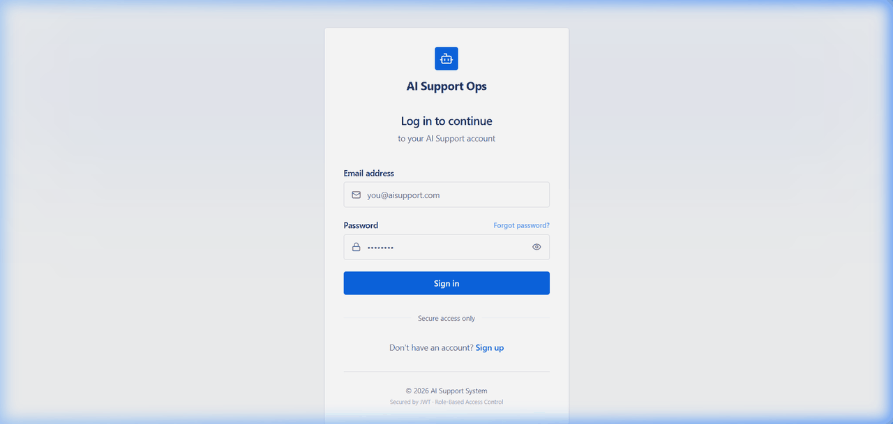

# AI Support System - Demo Video

## Platform Walkthrough (Animated)

The animated walkthrough below cycles through the key screens of the AI Support System, demonstrating the end-to-end flow from ticket creation through AI-powered resolution.

## Walkthrough Sequence

The GIF presents the following screens in order:

| # | Screen | What It Shows |
| - | ------ | ------------- |
| 1 | **Login** | JWT-authenticated sign-in with role-based access |
| 2 | **Ticket Submission** | Customer creates a new support ticket |
| 3 | **Customer Workspace** | Customer views their submitted tickets and statuses |
| 4 | **Redpanda Console** | Kafka `ticket-created` event payload in real-time |
| 5 | **Agent Queue** | Smart-routed ticket lands in the correct agent queue |
| 6 | **AI Insights** | Sentiment (ANGRY), urgency score, and intent classification |
| 7 | **AI Draft** | LLM-generated response draft citing knowledge articles |
| 8 | **RAG Context** | Retrieved knowledge base articles with similarity scores |
| 9 | **Ticket Timeline** | Full AI pipeline status from submission to resolution |
| 10 | **Knowledge Base** | Admin view of published and draft articles |
| 11 | **Admin Dashboard** | Operations center with AI governance metrics |

## Recording Details

- **Format:** Animated GIF (11 frames, 2.5 seconds per frame)
- **Resolution:** 1280px wide (aspect ratio preserved per screenshot)
- **File size:** ~1.2 MB
- **Loop:** Infinite

## Full Video Script (for narrated recording)

If you want to record a narrated version, the following script covers a 3-5 minute business story:

### 0:00 - 0:30 | Introduction & Architecture

- **Screen:** Architecture Diagram, then Customer Workspace.
- **Talking Points:** Customer support teams face a bottleneck triaging tickets. This event-driven AI platform automates the pipeline from ingestion to resolution using Spring Boot and Kafka.

### 0:30 - 0:45 | Ticket Submission

- **Screen:** Customer Workspace → New Ticket Form.
- **Talking Points:** A customer submits a ticket about a failed payment. It appears instantly as `PENDING`.

### 0:45 - 1:00 | Event Ingestion (Kafka)

- **Screen:** Redpanda Console.
- **Talking Points:** The `ticket-service` publishes a `TicketCreatedEvent` to Kafka. The `ai-orchestration-service` consumes it asynchronously.

### 1:00 - 1:30 | AI Analysis

- **Screen:** Agent Workspace → Ticket Detail.
- **Talking Points:** The orchestrator calls the `ai-analysis-service` using Google GenAI. The ticket updates with `Sentiment: ANGRY` and `Urgency: 95/100`.

### 1:30 - 2:00 | RAG & Decision Draft

- **Screen:** Ticket Detail (AI Draft section).
- **Talking Points:** The orchestrator triggers the `rag-service` for a pgvector similarity search. The AI drafts a response citing specific Knowledge Base articles.

### 2:00 - 2:15 | Smart Routing

- **Screen:** Agent Queue.
- **Talking Points:** Based on urgency and intent, the `routing-service` assigns the ticket to Tier 2 Billing, bypassing the general queue.

### 2:15 - 2:45 | Knowledge Base Management

- **Screen:** Knowledge Base Admin.
- **Talking Points:** Admins manage markdown articles. Embeddings are synced to pgvector in real-time when articles are saved.

### 2:45 - 3:15 | Admin Operations Center

- **Screen:** Admin Dashboard.
- **Talking Points:** The dashboard tracks AI latency, confidence rates, and platform health across all microservices.

### 3:15 - 3:45 | Conclusion

- **Screen:** GitHub Repository.
- **Talking Points:** This platform demonstrates a production-ready blueprint combining Event-Driven Architecture, Generative AI, and vector search.
